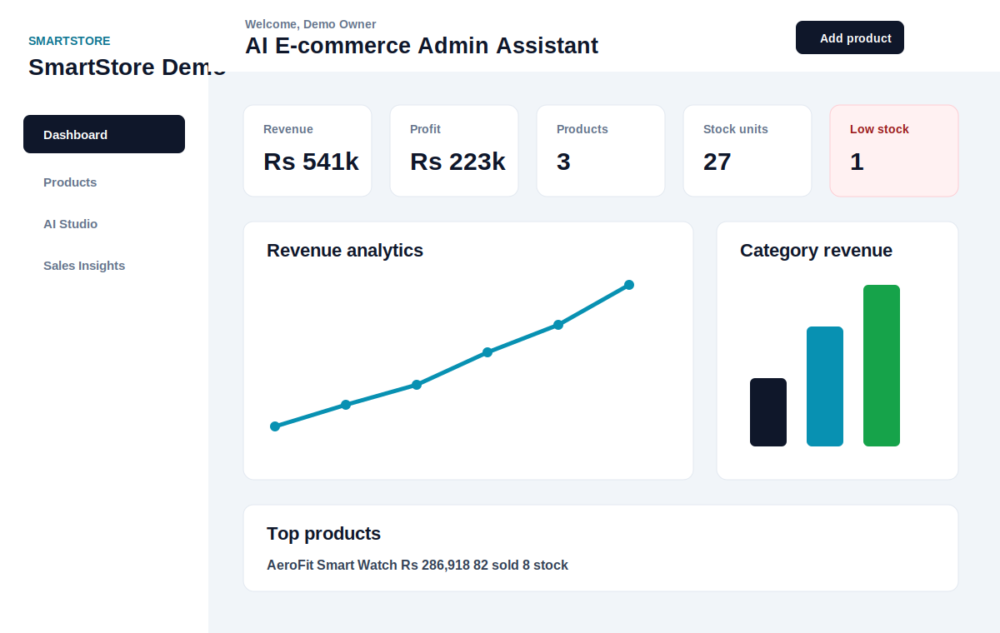
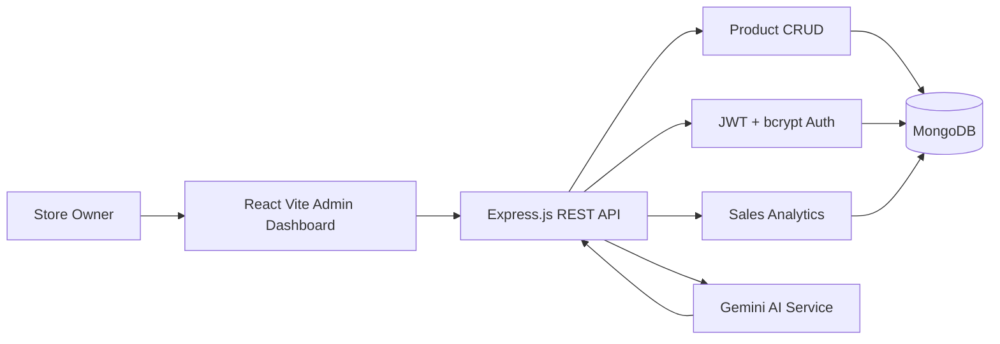

# SmartStore AI

SmartStore AI is an AI-powered e-commerce admin assistant where store owners manage products, generate product descriptions, SEO tags and marketing captions with Gemini, and track sales analytics from one dashboard.

## Current Improvements Added

- Built an Express.js backend with MongoDB, JWT authentication and bcrypt password hashing.
- Added protected product CRUD APIs.
- Added Gemini-based product content generation.
- Added Gemini-based sales suggestions with safe fallback output when `GEMINI_API_KEY` is missing.
- Added analytics APIs for revenue, profit, top products, category revenue and low-stock products.
- Replaced the placeholder React screen with a full Vite + Tailwind admin dashboard.
- Added Chart.js revenue and category charts.
- Added sample product seeding for fast viva demos.
- Added API, database and viva documentation.

## Tech Stack

Frontend:

- React with Vite
- Tailwind CSS
- Chart.js and react-chartjs-2
- Axios

Backend:

- Node.js
- Express.js
- MongoDB with Mongoose
- JWT
- bcryptjs
- Gemini API through `@google/generative-ai`

## Screenshots

Dashboard preview:



Replace this preview with live screenshots after running the app:

- `docs/screenshots/login.png`
- `docs/screenshots/dashboard.png`
- `docs/screenshots/products.png`
- `docs/screenshots/ai-studio.png`
- `docs/screenshots/insights.png`

## Demo Video

Record a 2-4 minute demo video and add the link here:

```txt
Demo video: https://your-video-link-here
```

Recommended demo order:

1. Signup or login.
2. Load sample products.
3. Show product CRUD.
4. Generate Gemini content.
5. Show dashboard charts.
6. Show sales suggestions and low-stock alerts.

## Architecture



## Database Schema

### User

```js
{
  name: String,
  email: String,
  storeName: String,
  password: String
}
```

### Product

```js
{
  user: ObjectId,
  name: String,
  category: String,
  price: Number,
  costPrice: Number,
  stock: Number,
  unitsSold: Number,
  description: String,
  seoTags: [String],
  marketingCaptions: [String],
  geminiNotes: String,
  monthlySales: [{ month: String, revenue: Number, units: Number }]
}
```

Full schema details are in [docs/database-schema.md](docs/database-schema.md).

## Folder Structure

```txt
smartstore-ai/
  backend/
    src/
      config/
      middleware/
      models/
      routes/
      services/
      utils/
      server.js
  frontend/
    src/
      App.jsx
      App.css
      index.css
      main.jsx
  docs/
    api-reference.md
    database-schema.md
    viva-guide.md
    screenshots/
```

## Setup Instructions

### 1. Backend

```bash
cd backend
npm install
copy .env.example .env
npm run dev
```

Update `backend/.env`:

```txt
PORT=5000
MONGO_URI=mongodb://127.0.0.1:27017/smartstore_ai
JWT_SECRET=replace_with_a_long_secret_for_viva
JWT_EXPIRES_IN=7d
CLIENT_URL=http://localhost:5173
GEMINI_API_KEY=your_gemini_api_key_here
GEMINI_MODEL=gemini-1.5-flash
```

### 2. Frontend

```bash
cd frontend
npm install
npm run dev
```

Open:

```txt
http://localhost:5173
```

## API Endpoints

Detailed endpoint docs are in [docs/api-reference.md](docs/api-reference.md).

Main endpoints:

- `POST /api/auth/signup`
- `POST /api/auth/login`
- `GET /api/auth/me`
- `GET /api/products`
- `POST /api/products`
- `POST /api/products/seed`
- `PUT /api/products/:id`
- `DELETE /api/products/:id`
- `POST /api/ai/content`
- `POST /api/ai/products/:id/content`
- `GET /api/ai/sales-suggestions`
- `GET /api/analytics/dashboard`

## Expected Flow

1. Store owner signs up or logs in.
2. Store owner adds products or loads sample data.
3. Gemini generates descriptions, SEO tags and captions.
4. Dashboard tracks revenue, profit, top products and category performance.
5. Sales Insights recommends pricing, promotion and inventory improvements.

## Viva Preparation

Read [docs/viva-guide.md](docs/viva-guide.md) before the viva. It includes:

- One-minute explanation
- Demo flow
- Likely questions
- Answers for JWT, bcrypt, MongoDB, Gemini and analytics
- Future improvements

## Git Commit Requirement

The project reaches the required minimum of 7 commits after the final documentation commit. Before submission:

```bash
git log --oneline
git push origin main
```

Push before 3:00 PM on May 23, 2026.

## Future Scope

- Real order import from Shopify or WooCommerce.
- Product image upload using Cloudinary or S3.
- Email alerts for low inventory.
- PDF and CSV sales reports.
- Role-based access for staff.
- More advanced Gemini trend forecasting from historical sales.
