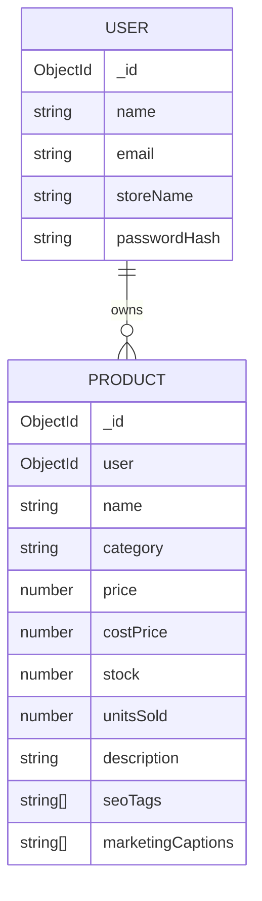

# Database Schema

Database: MongoDB  
ODM: Mongoose

## User Collection

```js
{
  _id: ObjectId,
  name: String,
  email: String,
  storeName: String,
  password: String,
  createdAt: Date,
  updatedAt: Date
}
```

Important points:

- `email` is unique.
- `password` is stored as a bcrypt hash.
- JWT payload stores the user id.

## Product Collection

```js
{
  _id: ObjectId,
  user: ObjectId,
  name: String,
  category: String,
  price: Number,
  costPrice: Number,
  stock: Number,
  unitsSold: Number,
  imageUrl: String,
  status: "active" | "draft" | "archived",
  description: String,
  seoTags: [String],
  marketingCaptions: [String],
  geminiNotes: String,
  monthlySales: [
    {
      month: String,
      revenue: Number,
      units: Number
    }
  ],
  createdAt: Date,
  updatedAt: Date
}
```

Virtual fields:

- `revenue = price * unitsSold`
- `profit = (price - costPrice) * unitsSold`

## Relationships


